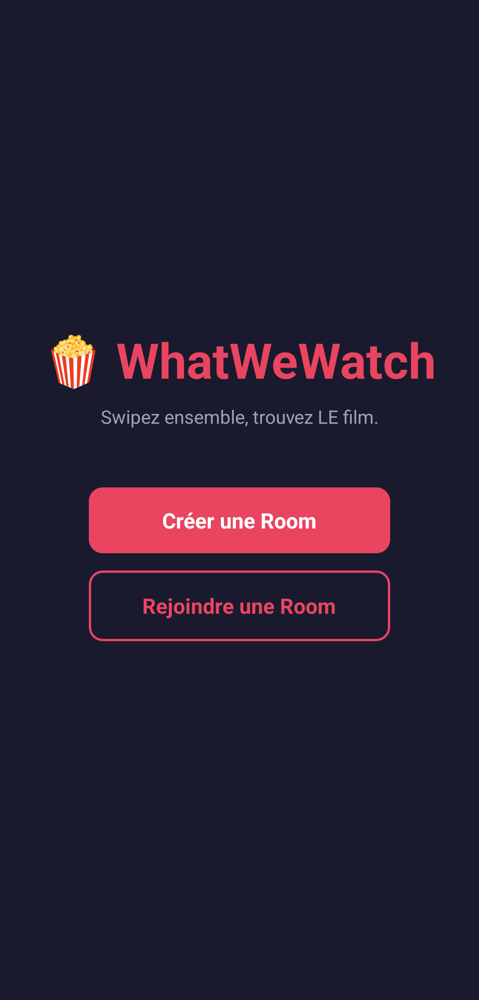

# 🍿 WhatWeWatch 🍿

**Swipez ensemble, trouvez LE film.**

WhatWeWatch est une appli mobile qui résout le problème universel : "On regarde quoi ce soir ?". Créez une room, invitez vos potes, swipez sur des films style Tinder, et découvrez vos matchs communs.

<p align="center">
  
</p>

## Installer l'appli

**Android** — [Télécharger l'APK (v1.0.0)](https://github.com/noahnormand/WhatWeWatch/releases/tag/v1.0.0)

Ouvrez le lien sur votre téléphone Android, téléchargez l'APK, installez-le, et c'est parti !

## Comment ça marche

1. **Créer une Room** — Un code à 4 chiffres est généré
2. **Partager le code** — Vos potes rejoignent avec ce code
3. **Swiper** — Chacun swipe les films (Smash 👍 ou Pass 👎)
4. **Matchs** — Les films que tout le monde a aimé s'affichent

## Stack technique

- **React Native** + **Expo** — Framework mobile cross-platform
- **TypeScript** — Typage statique
- **Firebase Firestore** — Base de données temps réel (rooms, votes)
- **TMDB API** — Catalogue de films (affiches, synopsis, tendances)
- **React Native Reanimated** — Animations fluides (swipe, rotation)
- **React Native Gesture Handler** — Gestes tactiles (drag)

## Lancer le projet en développement

### Prérequis

- [Node.js](https://nodejs.org/) (LTS)
- [Expo Go](https://expo.dev/go) sur votre téléphone
- Un compte [TMDB](https://www.themoviedb.org/) (gratuit) pour la clé API
- Un projet [Firebase](https://firebase.google.com/) avec Firestore activé

### Installation

```bash
git clone https://github.com/noahnormand/WhatWeWatch.git
cd WhatWeWatch
npm install
```

### Configuration

Créez un fichier `.env` à la racine du projet :

```
EXPO_PUBLIC_TMDB_API_KEY=votre_cle_tmdb
EXPO_PUBLIC_FIREBASE_API_KEY=votre_cle_firebase
EXPO_PUBLIC_FIREBASE_AUTH_DOMAIN=votre_projet.firebaseapp.com
EXPO_PUBLIC_FIREBASE_PROJECT_ID=votre_projet
EXPO_PUBLIC_FIREBASE_STORAGE_BUCKET=votre_projet.firebasestorage.app
EXPO_PUBLIC_FIREBASE_MESSAGING_SENDER_ID=votre_sender_id
EXPO_PUBLIC_FIREBASE_APP_ID=votre_app_id
```

### Lancement

```bash
npx expo start
```

Scannez le QR code avec Expo Go sur votre téléphone.

## Structure du projet

```
WhatWeWatch/
├── app/
│   ├── _layout.tsx      # Layout principal + navigation
│   ├── index.tsx        # Écran d'accueil
│   ├── join.tsx         # Rejoindre une room
│   ├── lobby.tsx        # Lobby (affiche le code)
│   ├── swipe.tsx        # Swipe des films
│   └── matches.tsx      # Résultats des matchs
├── service/
│   ├── firebase.ts      # Config Firebase
│   ├── rooms.ts         # Logique rooms + votes
│   └── tmdb.ts          # Appels API TMDB
└── assets/
```

## Auteur

**Noah Normand** — [@noahnormand](https://github.com/noahnormand)
